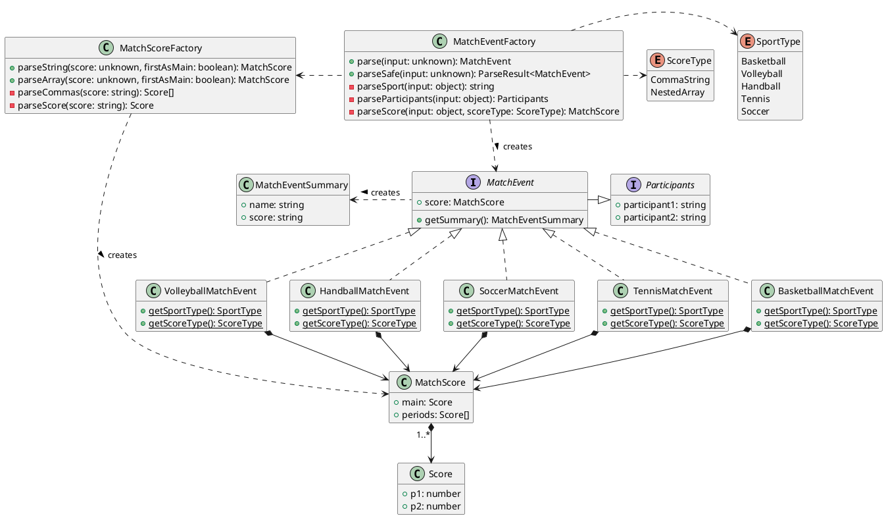
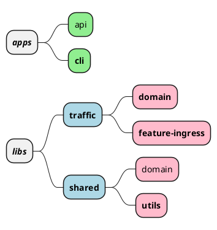

# Statscore exercise

Exercise files are located in `exercise` directory. The input was extracted to `input.json` file.

Read description below to learn about the project structure and repository features.

## Getting started

The project is built with NX so building and running can things can be done using NX targets. Running the commands twice the second run will hit NX cache since files did not change.

#### Install deps

This should install dependencies and setup git-hooks.

```sh
npm install
```

#### Lint

```sh
nx run-many --target=lint
```

#### Tests

```sh
nx run-many --target=test
```

#### Build CLI app

```sh
nx build cli
nx run cli:build
```

#### Build CLI app

The build step will create files in `dist/apps/cli`.

```sh
nx build cli
nx run cli:build # alternative
```

#### Run CLI app

With build process included. Note that the path to input JSON file is passed to the script as an argument in NX project config.

```sh
nx serve cli
nx run cli:serve # alternative

nx run cli:serve:development # with debug and watch
```

Raw - without build target and predefined arguments

```sh
node dist/apps/cli/main.js --input exercise/input.json
```

### Result

The CLI app should print the parsed events according to exercise app.js file.

```sh
$ node dist/apps/cli/main.js --input exercise/input.json
[
  {
    "name": "Chelsea - Arsenal",
    "score": "2:1"
  },
  {
    "name": "Germany - France",
    "score": "Main score: 3:0 (set1 25:23, set2 25:19, set3 25:21)"
  },
  {
    "name": "Pogoń Szczeciń vs Azoty Puławy",
    "score": "34:26"
  },
  {
    "name": "GKS Tychy - GKS Katowice",
    "score": "9:7,2:1,5:3,9:9"
  },
  {
    "name": "Maria Sharapova vs Serena Williams",
    "score": "Main score: 2:1 (set1 7:6, set2 6:3, set3 6:7)"
  }
]
```

## Before refactor

I assumed that in a standard scenario, the code would be part of a larger codebase. Before the refactoring, I would:

1. Talk with the primary code owner - team or team member to establish the right course of the refactor.
2. Analyze the rest of the codebase (surrounding module) and look for coding conventions (naming, module boundaries, testing, etc.) to make sure that the refactored code meets the standards and conventions.
   1. If the refactor would force me to establish new conventions or change the existing ones I'd talk with the team to agree on a common solution and document it if needed.

This project is complex on purpose. Working on this refactor I had scalability, maintainability and developer experience in mind.

### Traffic domain

`Traffic` is the chosen name of the domain which is responsible for event management. For further development it would be best to separate the code into `ingress` and `egress` subdomains or even into separate libraries - it all depends on the domain itself.

The diagram below shows the domain class structure. Factory classes are responsible for creating domain objects - `MatchEvent` and `MatchScore`. Each `MatchEvent` has the knowledge and data of how to create its summary (name and score). Note that the domain library does not depend on any infrastructure interface and thus can be used by multiple consumers (e.g. HTTP API, CLI, QueryBus, etc).


<details><summary>Diagram source</summary>



</details>

#### Parsing

The pre-parsing of the input objects, before creating the ValueObjects could be done using third-party libraries like `zod`. Not knowing the project's policy on the libraries I've decided to implemented the simplified parsing myself.

### Ingress use-case

The target use-case is located in `feature-ingress` library and is implemented in `IngressService`. The library is a NestJS module that exports `ParseCommand` - an implementation of `nest-commander` command that allows exposing NestJS features as a CLI tool.

Alongside the command, we can implement a Controller consuming `IngressService` exposing the feature as HTTP API.

### Project apps and libs structure

The project is a monorepo managed by NX and is divided into apps and libs. Applications can only import libraries and libraries can only import other libraries. This allows to development and testing of libraries in isolation and forces the team to respect module boundaries.

The diagram below shows proposed repository structure. Emphasized items are implemented libraries.


<details><summary>Diagram source</summary>



</details>

### Notes and repository features

#### Brief summary

- PlantUML diagrams
- ESLint
  - @typescript-eslint with parsing - type-checked
- Prettier
  - import sort plugin
- NX monorepo
  - task orchestration
  - task execution cache
  - project management with generators
- git hooks with Husky
  - lintstaged
    - format files on commit
    - lint and fix files on commit
  - commitlint
    - conventional commits
    - commit scope integrated with NX monorepo

#### Tests

Every class in the domain and feature libraries is tested. Test files are co-located with the implementation.

#### NX and library structure

Approaching the refactor I assumed that the code is a part of a bigger codebase
because this is usually the case.
I've chosen NX to easily create and manage libraries and declare architectural module boundaries.
I've tried to separate domain model and services from shared utils and kernel (in the future).
I've added CLI application with NestJS to demonstrate how it integrates with the chosen repository management conventions and architecture.

Workspace graph generated by NX:


#### Further development

- The additional applications can be implemented exposing the implemented feature as Rest/GraphQL API, etc.
- CLI and other apps can be dockerized for convenience and deployment.
- CI/CD pipeline can be configured for the repository. NX targets and cache seamlessly integrates with popular tools like Jenkins, DroneCI, GitHub Actions, etc. 
- The CLI application can be e2e tested to ensure the data-flow correctness and error handling.
- If the team established some naming conventions, custom eslint rules can be implemented to verify them automatically.
