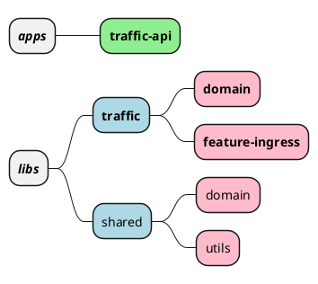

# Statscore exercise
Source exercise files are located in `exercise` directory.

## Before refactor
I assumed that in standard scenario the code would be part of a larger codebase. Prior to the refactor I would:
1. Talk with the primary code owner - team or team member to establish right course of the refactor.
2. Analyze the rest of the codebase (surrounding module) and look for coding conventions (naming, module boundaries, testing, etc.) to make sure that the refactored code meets the standards and conventions.
   1. If the refactor would force me to establish new conventions or change the existing ones I'd talk with the team to agree on common solution and document it if needed.

### Traffic domain
`Traffic` is the chosen name of the domain which is responsible for event management. For further development it would be the best to separate the code into `ingress` and `egress` subdomains or even into separate libraries.

### Project apps and libs structure
Project a monorepo managed by NX and is divided into apps and libs. Applications can only import libraries and libraries can import only other libraries. This allows to develop and test libraries in isolation and forces the team to respect module boundaries.

### Repository features
* ESLint
  * @typescript-eslint to lint with TS related rules
* Prettier
* NX monorepo
  * task orchestration
  * task execution cache
  * project management with generators
* git hooks with Husky
  * lintstaged
    * format files on commit
    * lint and fix files on commit
  * commitlint
    * conventional commits
    * commit scope integrated with NX monorepo

### Notes
Reasons behind decisions made during refactor.

#### Tests
// TODO

#### NX and library structure
Approaching the refactor I assumed that the code is a part of a bigger codebase
because this is usually the case. 
I've chosen NX to easily create and manage libraries and declare architectural module boundaries.
I've tried to separate domain model and services from shared utils and potentially kernel.
I've added some example application layer with NestJS to demonstrate how it integrates with the chosen repository management conventions and architecture.

#### Enums
Enums are controversial in TypeScript since TS team implements features
only when proposals reach stage 3 of TC39 Process. Enums are not a ECMAScript feature.
There are voices that simple type union is sufficient. I've used string-only enums with `enum` keyword
since they are the most versatile and combines TS enum typing and object manipulation features. 

#### Custom parsing

// TODO: describe zod can be used
